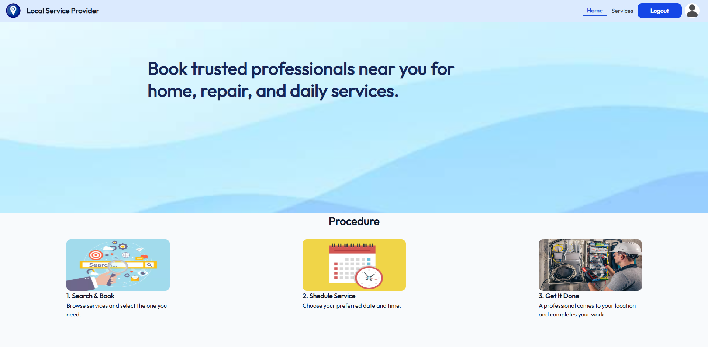
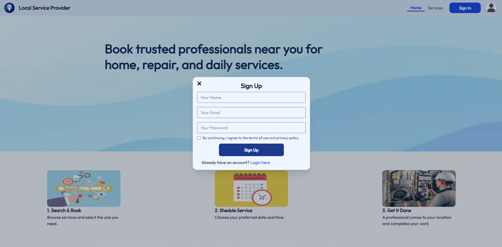
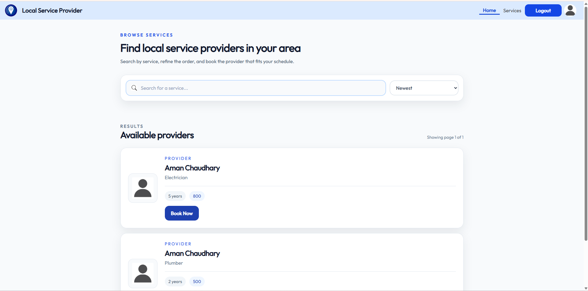
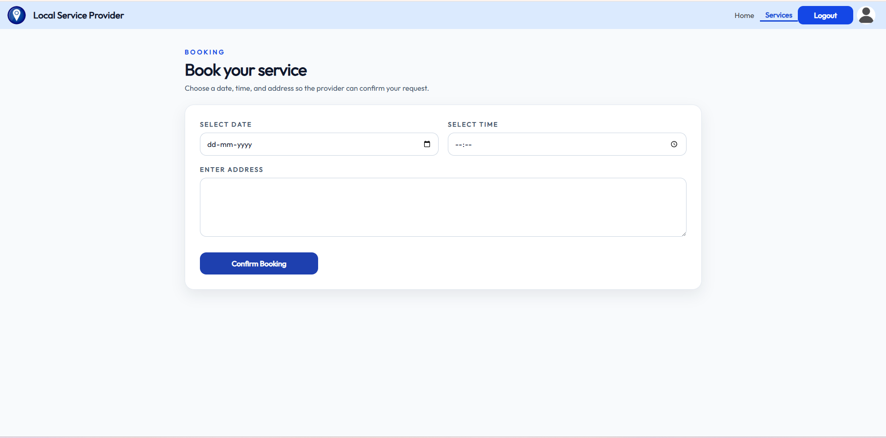
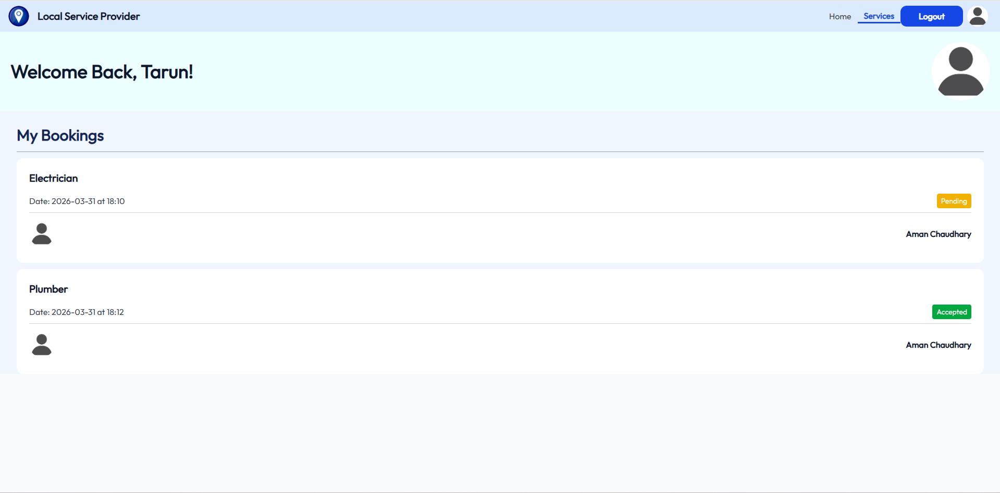
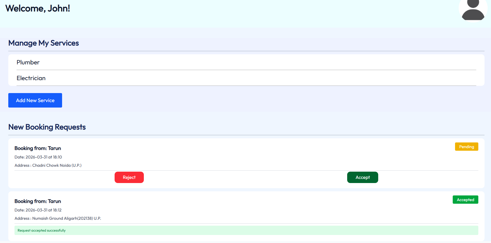
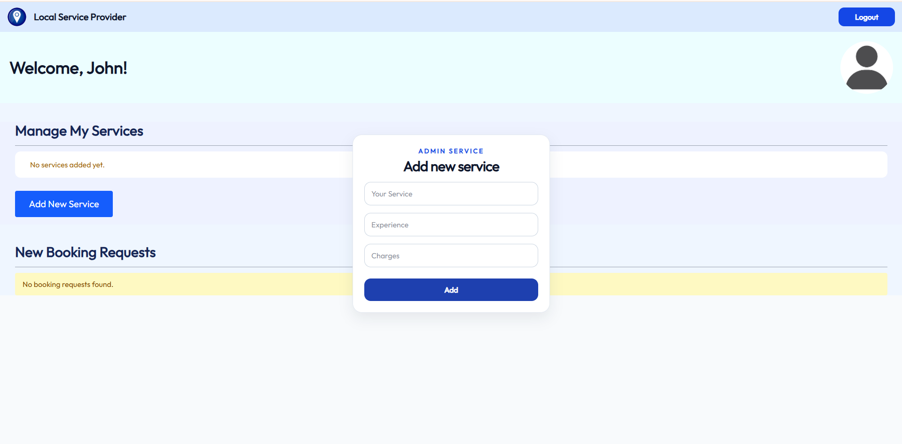

# Local Service Provider

Local Service Provider is a full-stack service-booking platform where users can discover service providers, place bookings, and track request status, while admins manage offered services and incoming booking requests from a separate dashboard.

This project is designed as a portfolio project that demonstrates full-stack application structure, role-based flows, API validation, and multi-app frontend architecture.

## Preview

### Demo Video
[Watch the full project walkthrough on Google Drive](https://drive.google.com/drive/folders/1nu1YP6xuS9PKMg0LxBwUmvrsTGCzoFFa?usp=drive_link)

### User App Screens






### Admin App Screens



## Features

- User-facing React app for browsing service providers and placing bookings
- Separate admin React app for provider login and booking/service management
- Express + MongoDB backend with structured routes, controllers, and models
- Search, sorting, and pagination for provider discovery
- Booking lifecycle support with `Pending`, `Accepted`, and `Rejected` states
- Admin flow for adding services and reviewing booking requests
- Request validation using Zod schemas
- Structured API responses for easier frontend error and success handling
- Docker Compose setup for running frontend, admin, and backend together locally

## Tech Stack

### Frontend
- React
- React Router
- Axios
- Tailwind CSS
- Vite

### Backend
- Node.js
- Express
- MongoDB
- Mongoose
- Zod
- JWT
- bcrypt
- cookie-parser
- helmet
- express-rate-limit

### Tooling
- Docker
- Docker Compose
- ESLint

## Project Structure

```text
.
|-- admin/      # Admin dashboard (React + Vite)
|-- backend/    # Express API + MongoDB models, controllers, and routes
|-- frontend/   # User-facing web app (React + Vite)
|-- gitAssets/  # Screenshots and demo recording for GitHub/portfolio use
`-- docker-compose.yml
```

## Challenges & Solutions

### 1. Managing two separate frontends
Challenge:
Keeping the user experience and admin workflow separate without mixing business logic or routes.

Solution:
The project uses two dedicated React + Vite apps, one for users and one for admins. This keeps each interface focused and makes the codebase easier to reason about.

### 2. Keeping request validation predictable
Challenge:
Form submissions can become difficult to debug when frontend and backend expectations drift apart.

Solution:
Zod schemas validate auth, service, and booking payloads before controller logic runs. That gives consistent API behavior and cleaner error handling.

### 3. Coordinating booking state across roles
Challenge:
Users and admins need to see the same booking lifecycle from different views.

Solution:
The backend stores booking status centrally and exposes separate user/admin endpoints so both sides work from the same source of truth.

### 4. Designing a role-based workflow
Challenge:
Role-aware apps become messy if access rules are scattered across the UI only.

Solution:
The backend is structured around role-specific routes and middleware so user and admin actions stay clearly separated.

### 5. Running multiple apps in development
Challenge:
Starting and coordinating frontend, admin, and backend manually can be repetitive.

Solution:
Docker Compose is included to run the full stack together, while each part can still be started independently during development.

## Running Locally

### Option 1: Docker

Create `backend/.env` with:

```env
MONGO_URI=your-mongodb-connection-string
JWT_SECRET=your-jwt-secret
```

Start the stack:

```bash
docker compose up --build
```

Apps:
- User app: `http://localhost:5173`
- Admin app: `http://localhost:5174`
- Backend API: `http://localhost:3000`

Note:
Docker Desktop must be running before `docker compose up --build` will work.

### Option 2: Run without Docker

Backend:

```bash
cd backend
npm install
npm run dev
```

Frontend:

```bash
cd frontend
npm install
npm run dev
```

Admin:

```bash
cd admin
npm install
npm run dev
```

## Deployment

### Live Demo
- Demo Assets Folder: https://drive.google.com/drive/folders/1nu1YP6xuS9PKMg0LxBwUmvrsTGCzoFFa?usp=drive_link
- Add your deployed user app link here
- Add your deployed admin app link here if you publish it separately
- Add your backend API link here if you deploy it separately

Example:

```md
- User App: https://your-frontend-link.com
- Admin App: https://your-admin-link.com
- API: https://your-backend-link.com
```

### Deployment Notes

- Frontend and admin can be deployed to Vercel or Netlify
- Backend can be deployed to Render, Railway, Fly.io, or a VPS
- MongoDB Atlas works well for hosted database infrastructure
- Replace hardcoded localhost API URLs with environment-based configuration before production deployment

## Current Limitations

- API URLs are still hardcoded for local development
- Docker setup depends on Docker Desktop running correctly on the host machine
- The project is strong as a portfolio piece, but still has room for production-level improvements in deployment, auth hardening, and automated testing

## Resume-Friendly Summary

Built a full-stack local service booking platform with separate user and admin applications using React, Node.js, Express, and MongoDB. Implemented service discovery, booking workflows, admin-side booking management, request validation, and a Docker-based local development setup.
